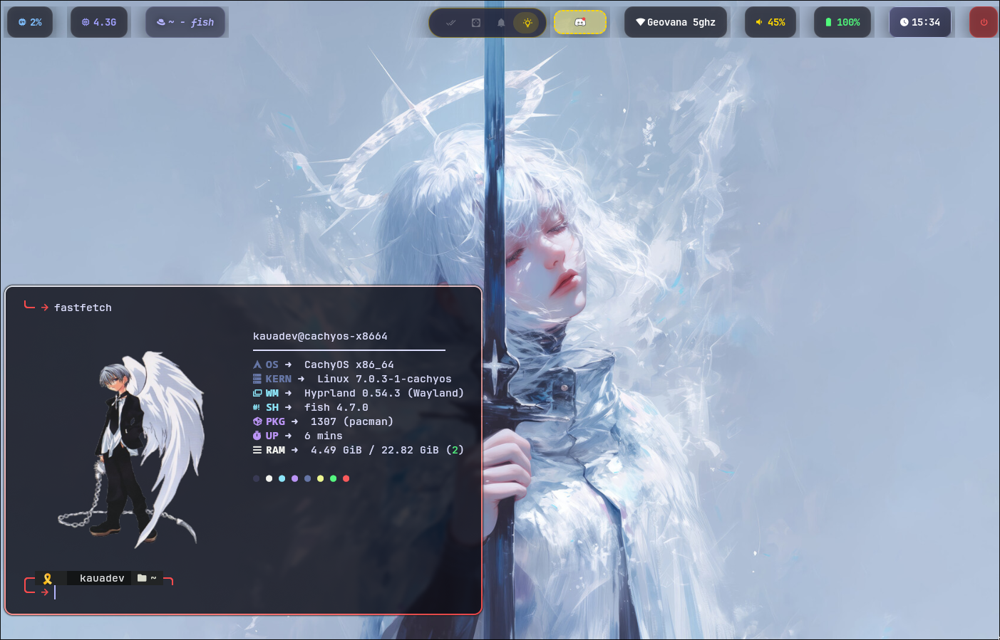
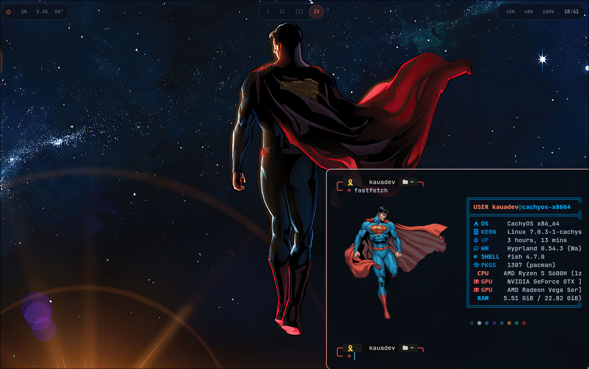
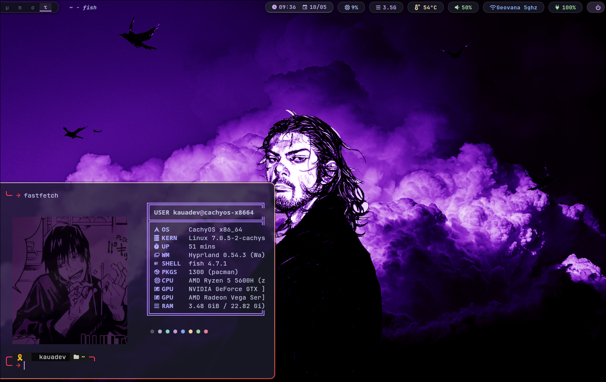
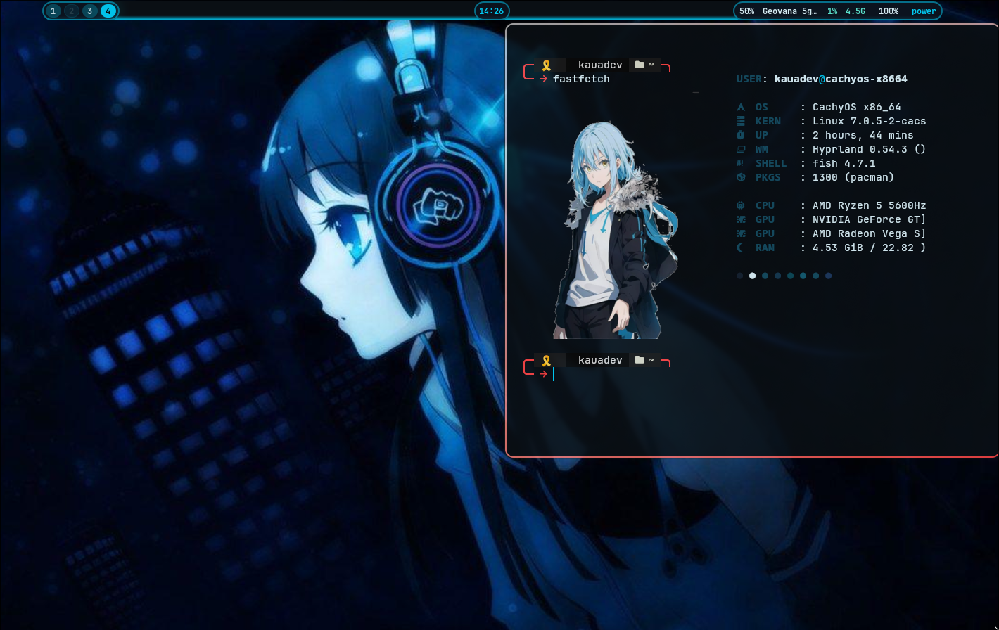
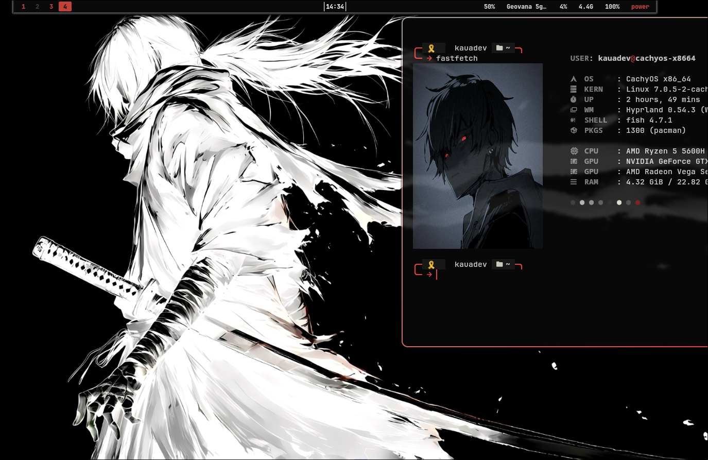

# 🎨 TEMAS - Hyprland & Wayland Configurations

Bem-vindo ao repositório de **TEMAS**! Este projeto contém configurações personalizadas para ambientes baseados em Wayland (especificamente testados no Hyprland), incluindo Waybar, Wofi, Wlogout e wallpapers.

## 🖼️ Galeria de Temas

Abaixo você pode ver uma prévia dos temas disponíveis. Esta galeria será atualizada conforme novos temas forem adicionados ao diretório `assets/`.

<div align="center">
  
  
  
  
  
  
  
</div>


---

## 🧹 O que é o Sweeper?

O **Sweeper** (`sweeper.py`) é o coração da automação deste repositório. Ele é um script em Python desenvolvido para facilitar a troca rápida e segura entre diferentes temas sem a necessidade de copiar arquivos manualmente ou lidar com links quebrados.

### Principais Funcionalidades:
- **Links Simbólicos Inteligentes:** Em vez de copiar arquivos, o Sweeper cria links simbólicos da pasta do tema diretamente para o seu `~/.config`. Isso significa que qualquer alteração feita na pasta do tema é refletida instantaneamente.
- **Backup Automático:** Antes de substituir qualquer pasta real em `~/.config`, o script realiza um backup em `~/.config/temas_backup/` para garantir que você não perca suas configurações anteriores.
- **Hot-Reload:** O script automaticamente recarrega o Hyprland e o Waybar após a aplicação do tema.
- **Gestão de Wallpaper:** Ele injeta cirurgicamente o caminho do novo wallpaper no seu arquivo `hyprpaper.conf` e reinicia o serviço de wallpaper para aplicar as mudanças na hora.

---

## 🚀 Como Usar

### Pré-requisitos
- Python 3 instalado.
- Ambiente Hyprland (opcional, mas recomendado para o hot-reload).
- Dependências: `hyprpaper`, `waybar`, `wofi`, `wlogout`.

### Aplicando um Tema
Para aplicar um tema, basta rodar o `sweeper.py` passando o nome da pasta do tema como argumento:

```bash
python sweeper.py alucard
```

Se nenhum argumento for passado, o script aplicará o tema **Branco** por padrão:
```bash
python sweeper.py
```

---

## 📂 Estrutura do Repositório

- `alucard/`: Configurações do tema Alucard.
- `Branco/`: Configurações do tema Branco.
- `superman/`: Configurações do tema superman.
- `angel/`: Configurações do tema angel.
- `assets/`: Recursos visuais e screenshots.
- `sweeper.py`: Script de automação.
  

---
*Desenvolvido para tornar sua experiência no desktop mais fluida e estilosa.*
